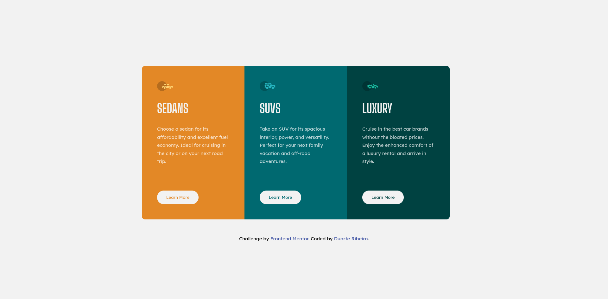

# Frontend Mentor - 3-column preview card component solution

This is a solution to the [3-column preview card component challenge on Frontend Mentor](https://www.frontendmentor.io/challenges/3column-preview-card-component-pH92eAR2-). Frontend Mentor challenges help you improve your coding skills by building realistic projects. 

## Table of contents

- [Overview](#overview)
  - [The challenge](#the-challenge)
  - [Screenshot](#screenshot)
  - [Links](#links)
- [My process](#my-process)
  - [Built with](#built-with)
  - [Useful resources](#useful-resources)
- [Author](#author)

**Note: Delete this note and update the table of contents based on what sections you keep.**

## Overview

### The challenge

Users should be able to:

- View the optimal layout depending on their device's screen size
- See hover states for interactive elements

### Screenshot

### Links

- Solution URL: [Add solution URL here](https://github.com/duartrosar/3-column-preview-card-component-main)
- Live Site URL: [Add live site URL here](https://vigorous-fermat-628273.netlify.app/)

## My process

### Built with

- Semantic HTML5 markup
- Flexbox
- Mobile-first workflow
- [Sass](https://sass-lang.com/) - Node Sass

### Useful resources

- Kevin Powell's [Youtube](https://www.youtube.com/user/KepowOb) and Conquering Responsive Layouts [Course](https://courses.kevinpowell.co/conquering-responsive-layouts)- Pretty much any video Kevin has on responsive layouts and sass, I love it! In this project (after watching some of his videos) I tried not to use the **height** property and also not use absolute units for the **width** of components.
- I absolutely love these [Sass Guidelines](https://sass-guidelin.es/) written by [Kitty Giraudel](https://kittygiraudel.com/), specially the section on [Architecture](https://sass-guidelin.es/#architecture). It inspired me to be more organized with my projects and create good habits.

## Author

- Github - [duartrosar](https://github.com/duartrosar)
- Frontend Mentor - [@duartrosar](https://www.frontendmentor.io/profile/duartrosar)

